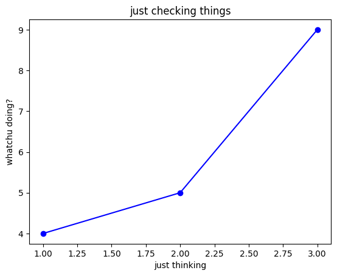

## Notes for Data Visualisation / `matplotlib`

### Types of Plots
- Line Graph
	- y-axis: values
	- x-axis: labels (categories, stuff?)
- Bar Graph
	- same
- Histograms
	- are for grouped continuous data.
	- they have a frequency and a class.


### 🔑 Core Ideas (TL;DR)
- Plot using `plt.{plot|bar}(x,y)`, which accepts two lists for the axes.
	- `plot` gives you a line, and `bar` gives you a bar.
- Use `plt.subplots()` to create figures and axes differently.
- You can plot many lines/stuff using multiple `plt.plot`s

### 🔧 Key Commands / Functions / Syntax
- `fig, ax = plt.subplots(figsize=(10, 5))`; create subplots
- `ax.plot(x, y, 'o-r', label="legend")`
	- the `o` is for the circle, `r` is for color. change that accordingly.
	- use the label for legend using `ax.legend()`
- `plt.show()` to show/render stuff.
- `ax.set_xticklabels(ax.get_xticklabels(), rotation=90)`; rotate x ticklabels
- `plt.xlabel("for x-axis")`
- `plt.ylabel("for y-axis")`
- `plt.title('LOOOK WHAT YOU HAVE DONE')`

### 🪛 Common Use Cases / Scenarios
- Comparisions
- Summary 
- And stuff like that

### 🧠 Gotchas / Misconceptions
- What people usually screw up.
	- not understanding how `plt.plot` accepts inputs.
	- read the docs bro.
	- use `ax` subplot only for the axes, not anything else.

### 🧪 Example / Use it once

```python
plt.plot([1, 2, 3], [4, 5, 9], 'o-b')
plt.xlabel("just thinking")
plt.ylabel("whatchu doing?")
plt.title("just checking things")
plt.show()
```



---
*nibir sankar, 2025.*