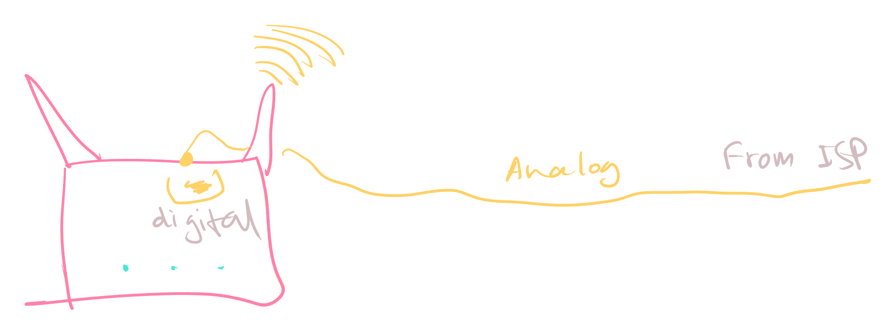
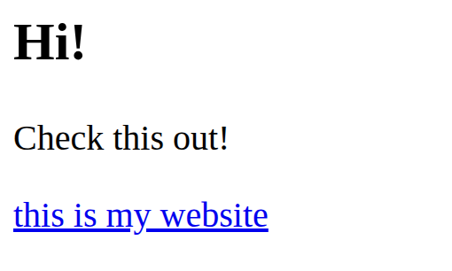

## Networking for dummies
### Introduction to Computer Networks
A Computer Network is an interconnection between devices and which can be
used to transfer data between each other.

**Packet:** communication happens in the form of packets. These are like "words" for internet.
### Types of Networks
- LAN (Local Area Network)
	- When you create a couple of devices locally (eg. your wifi/hotspot/ethernet), that makes it a LAN.
- MAN (Metropolitan Area Network)
	- Connect few LANs together, you get a MAN.
	- It is larger, usually spanning over a city or town.
- WAN (Wide Area Network)
	- Like MAN, this also happens when you connect LANs together
	- But it's spread VERY wide (eg. countries, continents).
### Network Devices
- Modem (MOdulator DEModulator)
	- Its entire function is to convert analog signals (from internet/telephone lines) to digital, so that you can use that in your device.
- Ethernet Card
	- Wired internet Gigachad.
- Hub
	- A device where there are multiple data input/outputs
	- Cons: the data which comes in, gets distributed to every output, which may not be desirable.
- Switch
	- Like a hub, it also has multiple data I/O. 
	- But it can analyse/process the data and send to selective devices instead of all.
	- This is very beneficial. Switches are used in big buildings and offices, schools. Try to hack into them if you can, and you can access everything.
- Router
	- More intelligent switch.
	- It analyses the packets that comes in and can process them before sending out to devices.
	- It technically contains a *modem* as well (the internet comes as analog signals from the ISP, the router then converts it to digital signal (wifi/wired))
 


"gateway" is the gateway between an isolated, local network and a foreign network. Every transmission must go *through* the gateway.

(Think of it like the bouncer outside a clubhouse)

### Networking Topologies
**Topology**: how a "surface" appears. Here it means, how the nodes are connected.
**Node**: any *device* in the network.

- Mesh
	- Every node is connected to each other.
	- To create a mesh with *n* nodes, you need *n(n-1)/2* wires.
- Ring/Circular
	- Every node is connected in a ring.
	- Data can transfer in only one direction (clockwise or counter-clockwise)
	- Con: If a device fails, the whole network fails. (Much like a circuit connected in series)
- Bus
	- Every node is connected to a single lengthwise bus.
	- Easy to maintain and allows for bi-directional data travel.
	- E.g. USB (Universal Serial **Bus**)
- Star
	- Every node is connected to a central networking device.
	- Easy to maintain and popular. 
	- E.g. your devices and your router.
- Hybrid/Tree
	- Mix of bus and star topologies.
### The Internet
Welcome, to the Internet.
### Applications of Internet
Do I really need to tell this?

But I do need to tell you these things:
#### WWW and a something else
World Wide Web is something you already know, but here are a few things that led to its creation and are still used to this day:
- HTML (HyperText Markup Language)
	- This is the main "language" that makes a website, that you can see.
	- It looks something like this:

```html
<div>
	<h2>Hi!</h2>
	<p>Check this out!</p>
	<a href="https://nibirsan.org/">this is my website</a>
</div>
```

Which will result in:



- **URI (Uniform Resource Identifier)** is a unique address for something in the whole internet.
	- The URL (Uniform Resource *Locator*) is a type of URI that uses the website address (like https://nibirsan.org/blog/ or https://thisisawebsite.com)
- HTTP (HyperText Transfer Protocol) is a protocol through how you can access webpages on the internet. HTTP*S* is the more secure (S = secure) version.
#### VoIP
VoIP stands for Voice over Internet Protocol. 
For example, WhatsApp calls, or Discord voice channels. That's VoIP. Nice.
### Website
Again, you already know what's a website is, right?
### Web Page
A website is made out of multiple webpages.

For example, let's take a website named `crazymf.com`. Here's what it's **sitemap** might look like:

- `crazymf.com/`
	- `/blog`
		- `/blog1`
		- `/blog2`
	- `/videos`
		- `/video1-don-t-watch`
	- `/shop`
		- `/buy-this-toy`

#### Static vs Dynamic webpage
Static webpages look the *same* to everyone. For example, my blog looks the same to everyone.

But dynamic webpages look different to everyone based on the user's choices. Examples include Amazon, Flipkart, Youtube, your PW website, etc.

### Web Server
This is where you put the website that you made with much blood and sweat. The web server then keeps the website "open". Which means, you need to keep the server open 24/7.

Because that's not possible to do that for many of us, we use something called a Virtual Private Server (VPS) or a hosting service like GitHub Pages or Vercel.

### Hosting of a website
You need to host your website somewhere if you want everyone to see it. 

**DNS:** Domain NameServer.

Here's how you do that:
- find/get a domain. you can do that using something called a "domain registrar"
- find/get a webserver/hosting service (github pages is a free one; AWS is a paid one)
- make a website and push it to the hosting service
- attach the hosting service DNS to the Domain.
	- which means you're "linking" the hosting service to your domain.
- google a lot and watch youtube videos on how to do that.
- you got a website!

Based on 100% true events.
### Browser
This is where you browse the web and watch [naughty videos](https://www.youtube.com/watch?v=dQw4w9WgXcQ).

Essentially, that's all it does. Though you can extend its capabilities by adjusting the settings and installing extensions/add-ons.

---
*nibir sankar, 2025.*